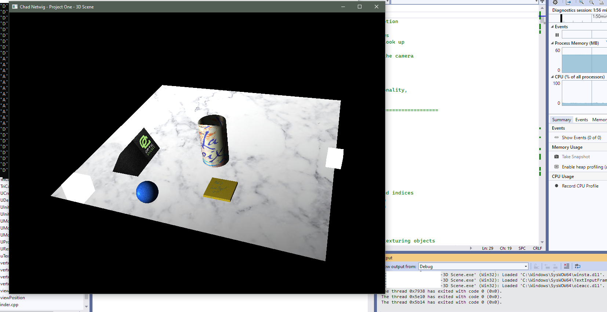
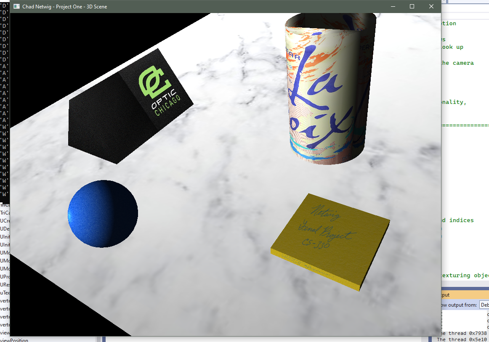
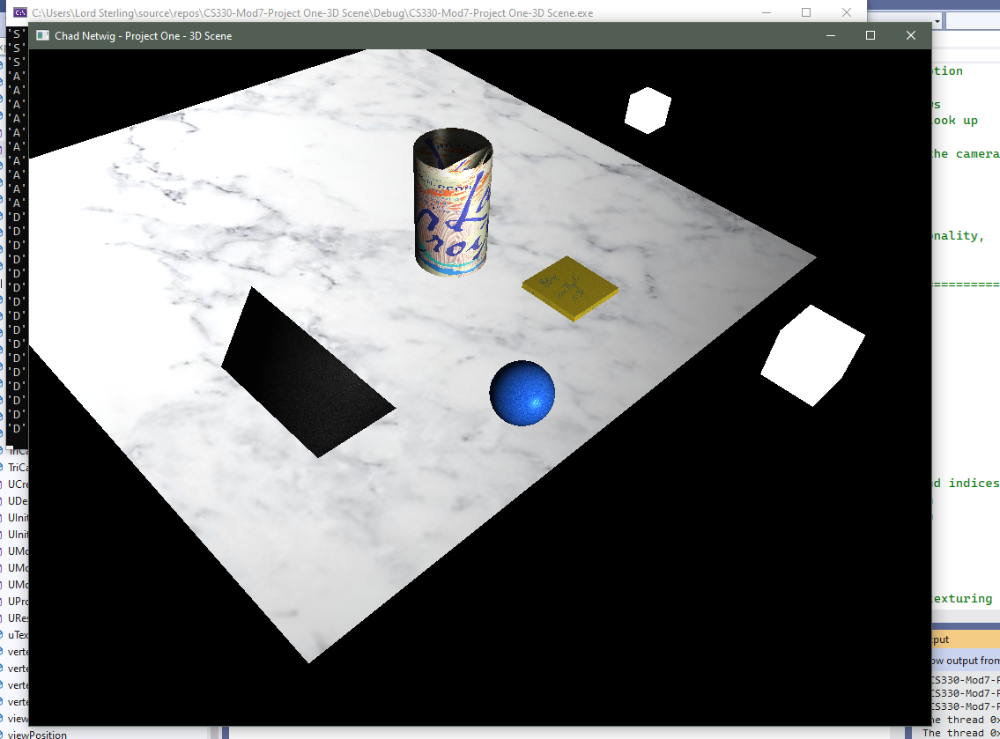
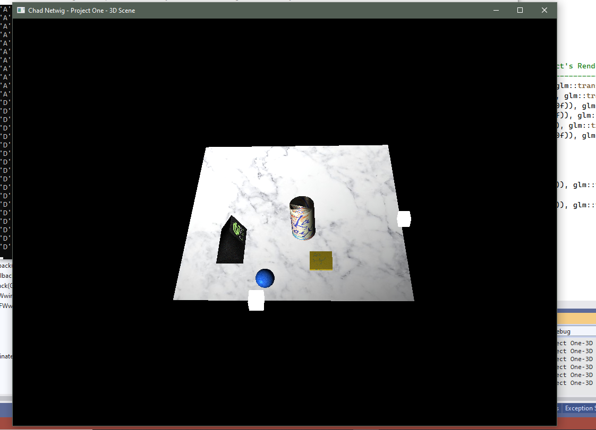
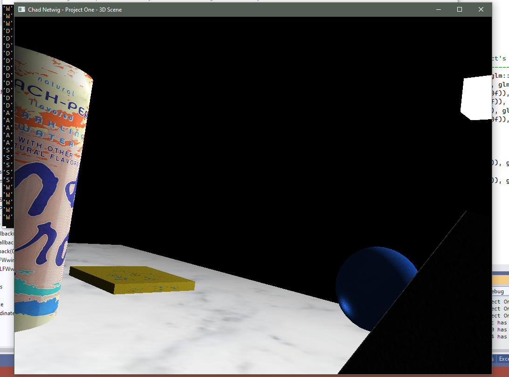
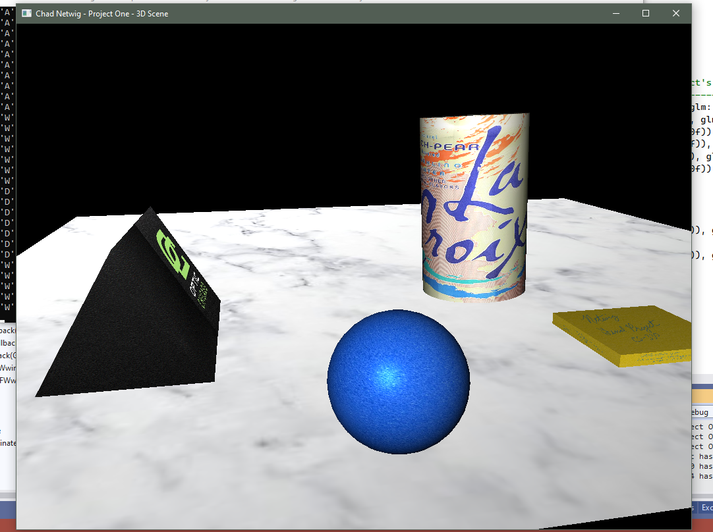
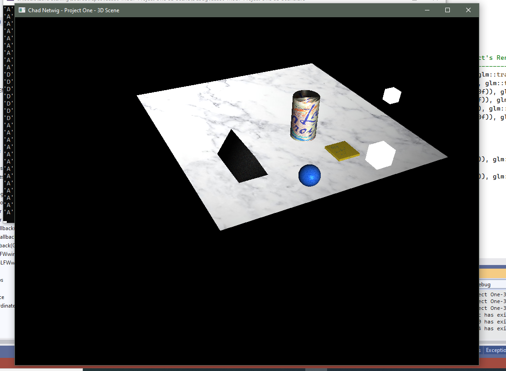

# OpenGL 3D Scene Renderer

This project renders a realistic 3D scene using modern OpenGL (version 4.x), featuring textured objects, dynamic lighting, and interactive camera controls. It was developed in C++ using Visual Studio 2022.



## 🎥 Demo Video

Watch the full demo on YouTube: [OpenGL 3D Scene Demo](https://youtu.be/VMbCMuGOCqk)  
<!-- Replace with your actual YouTube link -->

---

## 🔧 Features

- ✅ Four fully textured 3D models:
  - Tri-case with matte black texture and logo
  - Cylinder (La Croix can) with product texture
  - Blue foam-textured sphere
  - Cube of sticky notes with realistic paper texture
- ✅ Realistic lighting using the **Phong reflection model**
  - Main light: White, high-intensity point light
  - Fill light: Off-white, low-intensity side light
- ✅ Texture loading via `stb_image`
- ✅ Custom `GLObject` class handles mesh and texture abstraction
- ✅ Separate vertex and fragment shaders for both scene objects and lamps
- ✅ Fully interactive camera:
  - WASD + QE movement
  - Mouse look
  - Scrollwheel zoom
  - Perspective/Orthographic toggle (`P` key)

---

## 🧠 Technical Overview

- Written in C++ with GLEW, GLFW, and GLM
- Vertex/index-based mesh architecture
- Uses open-source sphere/cylinder geometry code by **Song Ho Ahn**, adapted to integrate with `GLObject`
- Handles dynamic user input for real-time scene navigation
- Commented and documented with `CLN:` tags throughout

---

## 📁 Project Structure

```
├── src/
│   ├── Netwig-OpenGL-3DScene.cpp
│   ├── Cylinder.h/.cpp
│   ├── Sphere.h/.cpp
│   └── camera.h
├── shaders/
│   ├── vertex_shader.glsl
│   └── fragment_shader.glsl
├── images/
│   ├── white-marble-plane.jpg
│   ├── LaCroix-texture.jpg
│   └── ...
├── screenshots/
│   └── Netwig-OpenGL-3DScene-Screenshot-1.png ... Screenshot-7.png
├── README.md
└── .gitignore
```

---

## 📸 Screenshots

| Screenshot | Description |
|------------|-------------|
|  | Full scene overview from initial camera position |
|  | Close-up of La Croix textured cylinder |
|  | Sphere with blue foam texture |
|  | Cubic sticky note object with realistic paper texture |
|  | View of main light and scene shadows |
|  | Orbiting camera side view |
|  | Perspective toggle view |

---

## 🚀 How to Run

1. Clone the repository:
   ```bash
   git clone https://github.com/ChadNetwig/OpenGL-3DScene.git
   cd OpenGL-3DScene
   ```

2. Open the `.sln` in Visual Studio 2022.

3. Build the project (ensure you have GLEW, GLFW, and GLM linked correctly).

4. Run the executable — enjoy the interactive 3D scene!

---

## 📜 License & Attribution

- **Cylinder/Sphere geometry** based on code by Song Ho Ahn (with modifications)
- All other code is original and released under the [MIT License](LICENSE)

---

## 🙋‍♂️ Author

**Chad Netwig**  
For inquiries or collaboration, reach out on [LinkedIn](https://linkedin.com/in/chadnetwig)